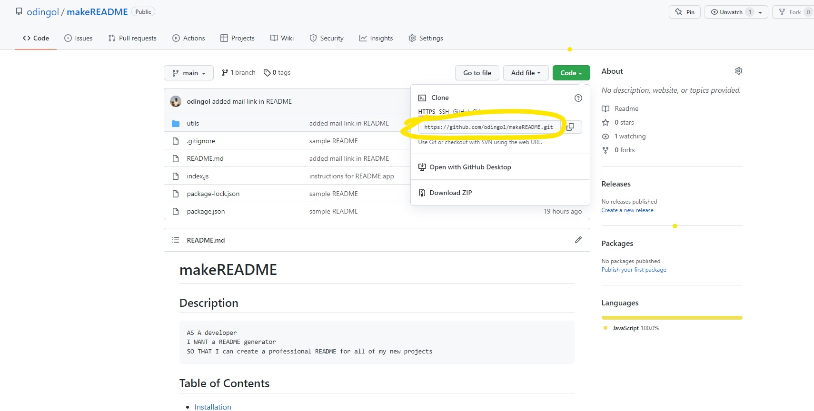
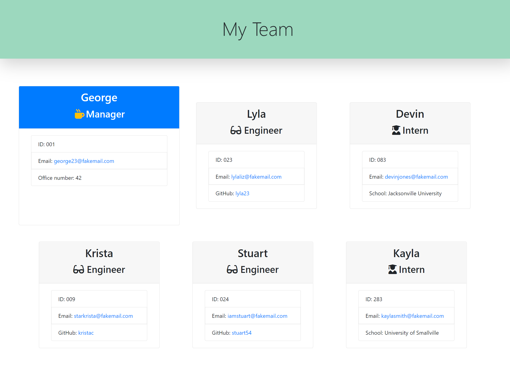

# teamprofile-generator
        
## Description
    
```md
AS A developer 
I WANT a manager to generate a webpage that displays their team's basic info 
SO THAT managers can have quick access to their emails and GitHub profiles
```
    
## Table of Contents
    
- [Installation](#installation)
- [Usage](#usage)
- [License](#license)
- [Contribute](#contribute)
- [Tests](#tests)
- [Questions](#questions)
    
## Installation
    
1) Go to my Github and clone this repo



<br>
2) Once downloaded, copy the code "npm install" and paste inside the terminal of your code editor

```bash
npm install
```
<br>
3) Once step 2 is completed, copy the code "node index.js" and paste inside the terminal to begin answering the prompt questions for the HTML page.

```bash
node index.js
```
<br>
4) After all questions are completed, the myteam.html file is instantly created inside the result folder.
<br>
<br>
    
 ## Usage
    
This CLI app is designed to create a professional html file from the user's input using Object-Oriented-Programming. The myteam.html file is created only when the user finishes answering all of the prompt questions. 

[CLICK HERE]() if you would like to follow along on YouTube.

<br>Here is an image of the application:

<br>


<br><br>
    
## License 
[](https://opensource.org/licenses/MIT)
    
    
The license included for this project is under MIT
    
    
## Contribute 
[](https://github.com/odingol/teamprofile-generator/issues)
    
Please click on the badge to report any issues if they exist
    
    
## Tests

Run any tests inside the command line using this code:
<br>
```bash
npm test
```
    

## Questions
    
Contact me: 

- [Github Profile](https://github.com/odingol) 
- [LinkedIn](https://www.linkedin.com/in/lamor-odingo/)

